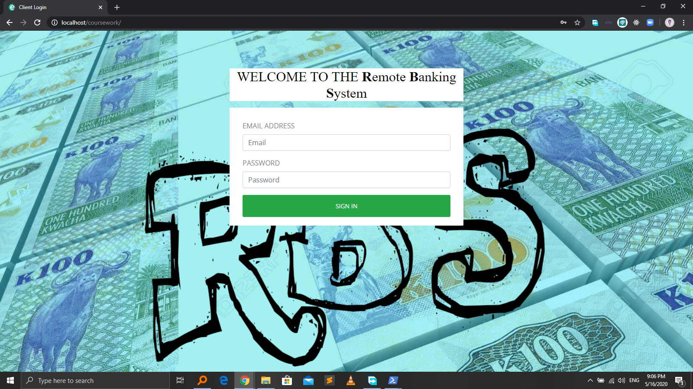
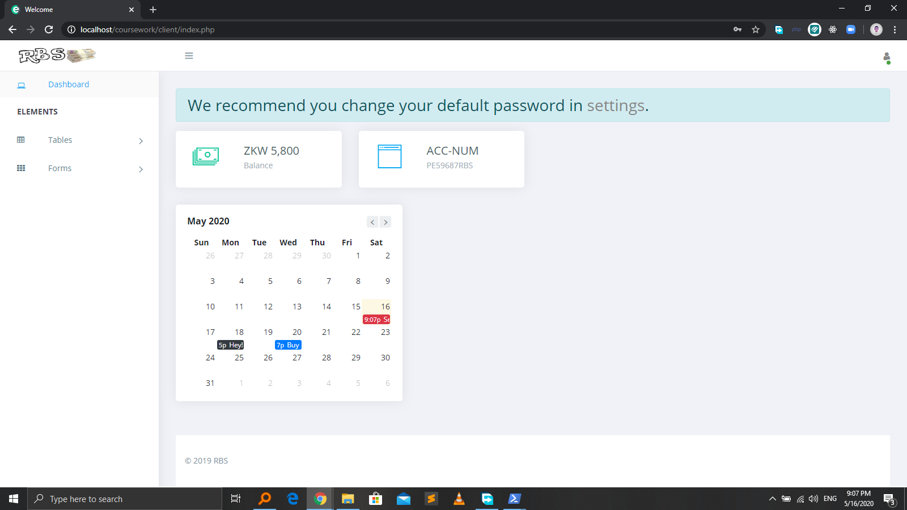
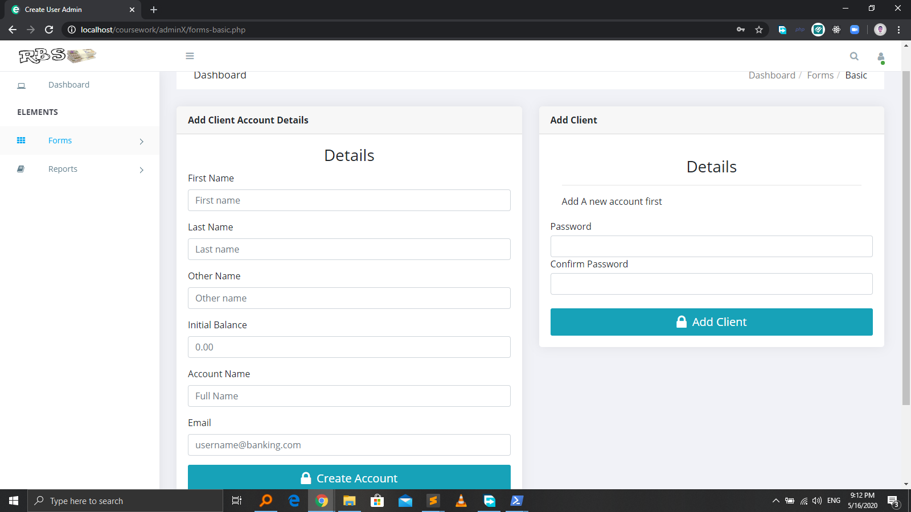
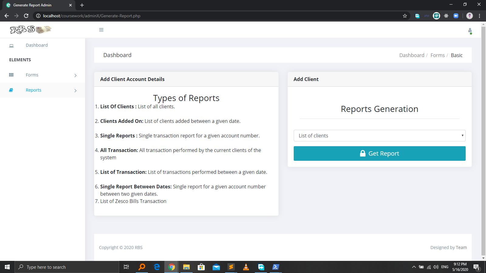

# RemoteBankingSystem-CourseWork
This is a repo for our 3rd year coursework at Mulungushi University  

The RBS or remote banking system is a simple web-based System developed to simulate how a small bank operates.  
A comprehensive report is located in documentation folder. 

The system is build on [Ela Admin template](https://github.com/puikinsh/ElaAdmin) 

The system is divided into two main users  

1. THE CLIENT
The client can view current balance, previous utity transactions and personal transactions

2. THE ADMIN
The admin can view all the client transactions, utity transactions, add new clients and generate reports. 
Username: admin Password: root.

THE TEAM

The team was made up of three people 
[Paul (Paulous) Kunda](https://github.com/paulouskunda) - Developer 
[Evans C. Chongo](https://github.com/EvansChomba) - Tester  
Joseph Mwanza

